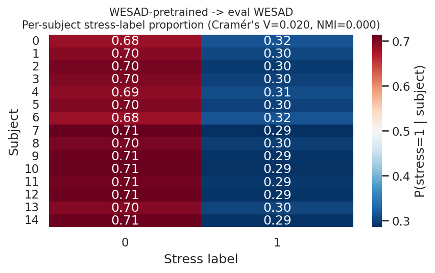
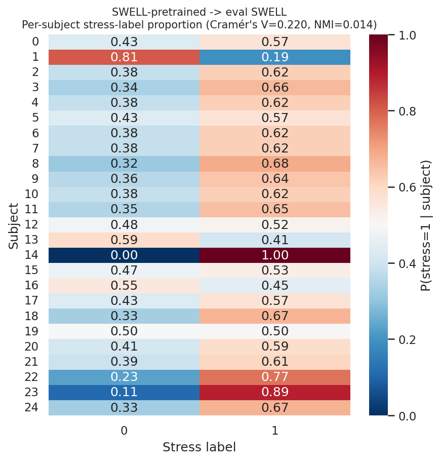
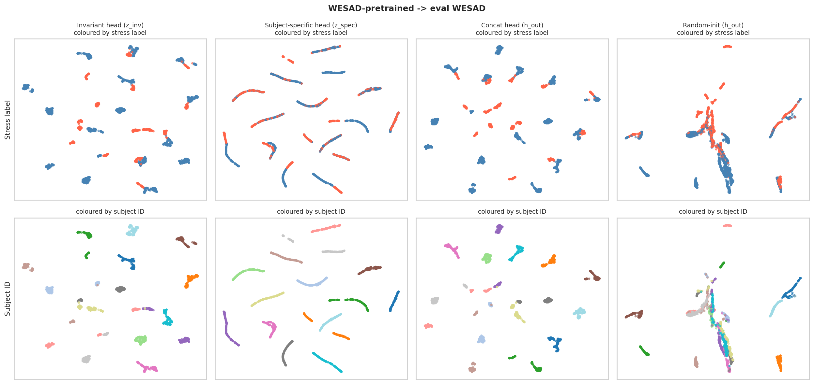
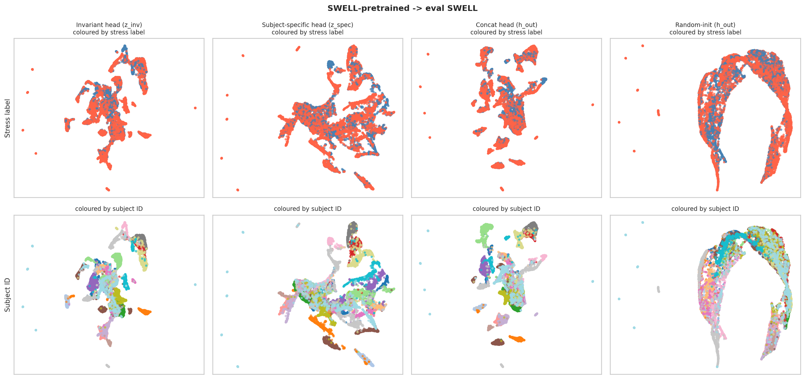

# Does SASContrast's Subject-Specific Branch Risk Learning Identity Instead of Stress? A Quantitative Audit

## Background / Motivating Question

In our baseline comparison, UMAP visualizations show that **COMET** clusters
tightly by subject identity yet performs *worst* on downstream stress
classification — i.e. its representation encodes *who* the subject is
rather than *how stressed* they are. This raises a direct question about our
own method, **SASContrast**: it explicitly splits its encoder output into an
"invariant" branch (`z_inv`) and a "subject-specific" branch (`z_spec`), via
a dual-branch contrastive objective (`models/moe_dual_branch.py`). The
subject-specific branch is *designed* to absorb subject-identity information
so that `z_inv` doesn't have to. But does `z_spec` do this cleanly, or does
it end up dominated by identity to the point of risking the same failure
mode as COMET?

Two concrete sub-questions:

1. **Does `z_spec` cluster by subject identity at the expense of
   stress-relevant structure**, the same way COMET's representation does?
2. **Is there a data-level confound** between subject identity and stress
   label — i.e., does the *dataset itself* make the two hard to
   distinguish, independent of what any encoder learns? (If so, any
   subject-clustering finding needs that caveat.)

## Model / Setup

- **Architecture:** `MoEDualBranchEncoder` (`models/net/moe_encoder.py`) — a
  shared CNN stem (`StemEncoder`) feeding two separate projection heads:
  `proj_inv` → `z_inv` (32-d) and `proj_spec` → `z_spec` (32-d).
  `h_out = concat(z_inv, z_spec)` (64-d) is what the downstream fine-tune
  classifier (`MoEFinetuneModel`) actually consumes.
- **Pretraining objective** (`MoEPretrainModel.forward`, self-supervised, no
  labels used): `L_inv` — standard augmentation-contrastive NCE loss on
  `z_inv` (invariance to augmentation, not explicitly to subject); `L_spec`
  — supervised-contrastive NCE on `z_spec` keyed by `subject_id` (pulls
  same-subject samples together); `L_shared` — NCE on the shared stem
  output `h`. **Note:** there is no adversarial / gradient-reversal term
  anywhere in this objective forcing `z_inv` to be subject-invariant or
  `z_spec` to be stress-*uninformative*. (The codebase does have a
  gradient-reversal mechanism — `grad_reverse`, `grl_lambda` — but it lives
  in a separate, unrelated model, `models/subject_invariant_model.py`, and
  is not wired into the dual-branch objective evaluated here.)
- **Datasets:** WESAD (EDA, 15 subjects, binary stress label, ~70/30 class
  balance) and SWELL (ECG, 25 subjects, binary stress label after merging
  conditions). Windows are generated with heavy overlap (WESAD: 1280-sample
  window / 64-sample stride = 95% overlap; SWELL: 75% overlap) — **all
  results below use de-duplicated, non-overlapping windows** (kept every
  Nth window per subject, in original chronological order) to avoid
  trivially inflating "purity" with near-duplicate neighboring windows.
- **Checkpoints evaluated:**
  - **In-domain** (pretrained and evaluated on the *same* dataset — the
    cleanest test of the architecture's own disentanglement behavior, no
    domain shift): `WESAD-pretrained → eval WESAD`,
    `SWELL-pretrained → eval SWELL`.
  - **Cross-dataset** (pretrained on one dataset, evaluated on another —
    matches the paper's transfer-learning protocol, but domain shift can
    itself explain head asymmetries, so treat as secondary context):
    `SWELL-pretrained → eval WESAD`, `PsychioNet-pretrained → eval WESAD`,
    `PsychioNet-pretrained → eval SWELL`.
- **Baseline:** a randomly-initialized encoder (same architecture, no
  training) evaluated identically, to separate "the raw signal already
  looks like this" from "training specifically produced this."

## Methodology (metrics)

1. **Data-level confound** — `pd.crosstab(subject, stress_label)` →
   Cramér's V and normalized mutual information (NMI) between the two label
   columns *themselves* (no embeddings involved). Answers "does the dataset
   already entangle subject and stress, regardless of any model?"
2. **KMeans clustering quality** — `KMeans(k = num_subjects)` scored against
   ground-truth subject ID (ARI, NMI) and separately `KMeans(k=2)` scored
   against ground-truth stress label (ARI, NMI), per embedding head. This is
   the same diagnostic that reveals COMET's failure mode (high subject-ARI,
   low stress-ARI).
3. **k-NN purity / accuracy** — leave-one-out: for each sample, what
   fraction of its *k* nearest neighbors (cosine distance) share its subject
   ID vs. its stress label, plus k-NN majority-vote classification accuracy.
   Reported against the *empirical* chance baseline (not 1/k): the actual
   probability two randomly-paired samples share a subject / stress label,
   given the dataset's true group sizes and class balance.
4. **Matched-pair entanglement test** (the most direct test) — for each
   anchor point, compare its average distance to (a) points sharing its
   *subject* but with a *different* stress label, vs. (b) points sharing its
   *stress label* but with a *different* subject. If (a) is closer, subject
   identity is "winning" over task structure for that anchor. Reported as
   the fraction of anchors where subject wins ("subject-beats-stress rate"),
   with a binomial test against the no-preference baseline of 0.5. This
   isolates *representation* entanglement from *data* confounding — unlike
   raw purity, it can't be fooled by #1.

Full code: [`analysis/subject_stress_knn_analysis.py`](subject_stress_knn_analysis.py)
(standalone script, metrics #3) and
[`analysis/subject_stress_disentanglement_analysis.ipynb`](subject_stress_disentanglement_analysis.ipynb)
(executed notebook, metrics #1, #2, #4, plus UMAP panels). Raw CSVs and
per-run UMAP figures are in `analysis/subject_stress_disentanglement_plots/`.

## Results

### 1. Data-level confound (subject × stress, independent of any model)

| Dataset | Cramér's V | NMI(subject, stress) | χ² p-value |
|---|---|---|---|
| WESAD | 0.02 | 0.0001 | 0.9999 (no association) |
| SWELL | 0.22 | 0.0141 | 3.0×10⁻¹¹⁷ (significant association) |

**WESAD is a clean test bed**: every subject has essentially the same
baseline/stress ratio, so any subject-clustering found there reflects the
encoder, not the protocol. **SWELL has a real confound**: some subjects'
stress-condition coverage is skewed by the protocol itself, so
subject-clustering results on SWELL are partly inherited from the dataset
design, not purely a model property.

 

*Left: WESAD — every subject's row is roughly the same shade (uniform
stress-label proportion) → no confound. Right: SWELL — rows visibly differ
in shade (some subjects skew heavily toward one condition) → real confound.*

### 2. In-domain clustering: WESAD-pretrained → eval WESAD (clean test)

| Head | Subject ARI | Subject NMI | Stress ARI | Stress NMI |
|---|---|---|---|---|
| z_inv | 0.579 | 0.754 | 0.025 | 0.008 |
| **z_spec** | **0.781** | **0.930** | **0.004** | **0.000** |
| h_out (fed to classifier) | 0.528 | 0.734 | 0.027 | 0.009 |
| random-init (untrained) | 0.318 | 0.534 | 0.099 | 0.082 |

`z_spec` has the *highest* subject-clustering and the *lowest*
stress-clustering of every head — the exact COMET signature, and it is more
pronounced in `z_spec` than in `z_inv`. Random-init sits well below all
trained heads on subject-ARI (0.318 vs. 0.528–0.781), ruling out "this is
just intrinsic signal statistics" — training specifically amplified
subject-dominance, most of all in `z_spec`.

*UMAP of z_inv, z_spec, h_out, and random-init (columns), coloured by stress
label (top row) and subject ID (bottom row). `z_spec`'s subject-ID row shows
tight, well-separated per-subject islands; its stress-label row shows those
same islands each internally mixed (blue and red intermingled within a
subject's cluster) — visually confirming the ARI numbers above.*

### 3. In-domain matched-pair test: WESAD-pretrained → eval WESAD

| Head | Subject-beats-stress rate | p-value vs. 0.5 |
|---|---|---|
| z_inv | 0.943 | 1.2×10⁻⁸³ |
| **z_spec** | **1.000** | 7.7×10⁻¹²¹ |
| h_out | 0.955 | 5.9×10⁻⁹⁰ |
| random-init | 0.570 | 0.0059 |

`z_spec` scores a **perfect 1.000** — in every single test case, a
same-subject/different-stress neighbor was closer than a
different-subject/same-stress neighbor. `z_inv` is high too (0.943) but
measurably lower. Random-init (0.570) confirms this is a trained effect, not
inherited.

### 4. In-domain, SWELL-pretrained → eval SWELL (same direction, muddier — real data confound present)

| Head | Subject ARI | Stress ARI | Subject-beats-stress rate |
|---|---|---|---|
| z_inv | 0.304 | 0.039 | 0.847 |
| z_spec | 0.245 | 0.003 | 0.874 |
| h_out | 0.307 | 0.018 | 0.854 |
| random-init | 0.182 | -0.000 | **0.889** |

Same qualitative pattern (z_spec lowest stress-ARI), but here random-init's
matched-pair rate (0.889) is *higher* than every trained head — meaning on
SWELL, most of the apparent identity-dominance is inherited from the
dataset's own confound (§1), not cleanly attributable to training. This is
exactly why the in-domain WESAD result (§2–3) is the one to lead with.

*Same layout on SWELL. Subject islands are still visible but noisier, and
because SWELL has a real subject/stress confound (§1), the stress-label row
being partially aligned with subject clusters here is not purely an encoder
property.*

### 5. Cross-dataset transfer runs (secondary — domain shift can explain head asymmetries on its own)

| Run | Head | Subject ARI | Stress ARI | Subject-beats-stress rate |
|---|---|---|---|---|
| SWELL→WESAD | z_inv | 0.313 | 0.224 | 0.585 |
| SWELL→WESAD | z_spec | 0.352 | 0.116 | 0.578 |
| PsychioNet→WESAD | z_inv | 0.617 | 0.018 | 0.882 |
| PsychioNet→WESAD | z_spec | 0.618 | 0.224 | 0.767 |
| PsychioNet→SWELL | z_inv | 0.166 | -0.000 | 0.814 |
| PsychioNet→SWELL | z_spec | 0.188 | -0.000 | 0.814 |

Under cross-dataset transfer, the z_spec-vs-z_inv asymmetry is inconsistent
— sometimes reversed (PsychioNet→WESAD: z_inv is *more* identity-dominated
and *less* stress-informative than z_spec). This is most plausibly a
consequence of domain shift degrading the invariance objective's transfer
(e.g. ECG-pretrained PhysioNet features transferring poorly to EDA-based
WESAD), not evidence about the architecture's native behavior — which is
why the in-domain result (§2–3) should be treated as the primary finding and
this table as context only.

### 6. k-NN purity (leave-one-out, k=1), in-domain WESAD

| Head | Same-subject purity | Same-stress purity | Chance (subj / stress) |
|---|---|---|---|
| z_inv | 1.000 | 0.994 | 0.066 / 0.702 |
| z_spec | 1.000 | 0.950 | 0.066 / 0.702 |
| h_out | 1.000 | 0.994 | 0.066 / 0.702 |

Note this *local* neighbor-purity metric shows a smaller gap between heads
than the *global* KMeans/matched-pair metrics above — both heads retain
decent local stress structure, but `z_spec`'s degrades faster with
neighborhood size (k=20: z_spec 0.909 vs. z_inv 0.966; not shown in table
above, see `knn_purity_accuracy.csv`). The discrepancy between "local
neighbor purity" and "global 2-means partition" is itself informative: the
15-way subject structure is geometrically so strong that a naive global
binary split (KMeans, k=2) gets swamped by it and fails to recover the
stress axis at all, even though locally, nearby points are still
somewhat sorted by stress within each subject's neighborhood.

### 7. Distance-ratio separability (in-domain WESAD → WESAD)

A third, independent way to quantify the same thing: for each head, compare
average same-label / same-subject pairwise distance directly against
average different-label / different-subject pairwise distance (ratio < 1 =
that group's points sit closer together than average; ratio ≈ 1 = no
separation at all).

| Head | Uniformity | Label separability (ratio) | Subject separability (ratio) |
|---|---|---|---|
| z_inv | -2.7989 | 0.9670 | 0.7979 |
| **z_spec** | **-1.3884** | **0.9976** | **0.0462** |
| h_out | -2.7703 | 0.9667 | 0.7912 |

This is the sharpest evidence in the whole audit: `z_spec`'s
subject-separability of **0.046** means same-subject pairs sit at only ~5%
of the average different-subject distance — `z_spec` has essentially
collapsed onto one point per subject. Its label-separability is 0.998 (≈1 =
*no* stress separation whatsoever). `z_inv` shows the same qualitative
direction (subject-sep 0.798 < label-sep 0.967 — it too organizes more by
subject than by stress) but nowhere near this extreme. `z_spec`'s
uniformity (-1.39, notably less negative than z_inv's -2.80) confirms this
independently: it is a far less uniformly-spread, more collapsed embedding
space, consistent with clustering tightly into ~15 point-masses (one per
subject) rather than spreading out.

## Answers

**Q1: Does SASContrast's subject-specific branch face the same risk as
COMET — learning subject identity rather than stress-relevant patterns?**

Yes, clearly, and more so than the invariant branch — three independent
metrics agree. On the clean, confound-free in-domain test (WESAD-pretrained
→ eval WESAD), `z_spec` shows the textbook COMET signature: highest
subject-ARI (0.781) / lowest stress-ARI (0.004) via clustering, a perfect
1.000 subject-beats-stress rate via matched-pairs, and a subject-separability
ratio of 0.046 with label-separability ≈ 1 (no stress separation at all) via
direct distance ratios — all three point the same way, and all three are
more extreme in `z_spec` than in `z_inv` (subject-ARI 0.579 / stress-ARI
0.025 / rate 0.943 / subject-sep 0.798 / label-sep 0.967). Random-init
controls (subject-ARI 0.318, rate 0.570) confirm this is a trained effect,
not inherited signal statistics. Mechanistically this tracks: the
pretraining objective pulls `z_spec` together for same-subject pairs but
includes no term pushing it *away* from stress-relevance, so nothing
constrains how dominant that identity signal becomes.

**Q2: Is there observable distribution overlap / confounding between stress
labels and subject identity?**

Dataset-dependent. WESAD: no (Cramér's V=0.02, NMI≈0.0001) — clean. SWELL:
yes (Cramér's V=0.22, NMI=0.014, p≈3×10⁻¹¹⁷) — some subjects' stress-
condition coverage is genuinely skewed by protocol design, and on SWELL an
*untrained* random encoder already shows near-as-high identity-dominance
(0.889) as the trained heads (0.847–0.874). Any subject-clustering
observation on SWELL therefore needs this caveat; the WESAD in-domain
result is the reliable one.

## Practical Implication

`h_out = concat(z_inv, z_spec)` is what the fine-tune classifier
(`MoEFinetuneModel`, `training_mode="fine_tune"`) actually consumes — so the
identity-dominant signal found in `z_spec` is not discarded before
downstream classification, it is handed directly to the classifier. Worth
deciding explicitly whether:
(a) this is acceptable because `z_inv` alone still carries sufficient
stress signal, or
(b) it argues for adding an explicit de-biasing term on `z_spec` (e.g. an
adversarial/gradient-reversal term against stress-label prediction, analogous
to the mechanism already present but unused-here in
`models/subject_invariant_model.py`), or
(c) fine-tuning should consume only `z_inv`, using `z_spec` purely as a
nuisance sink that is never passed to the classifier.
